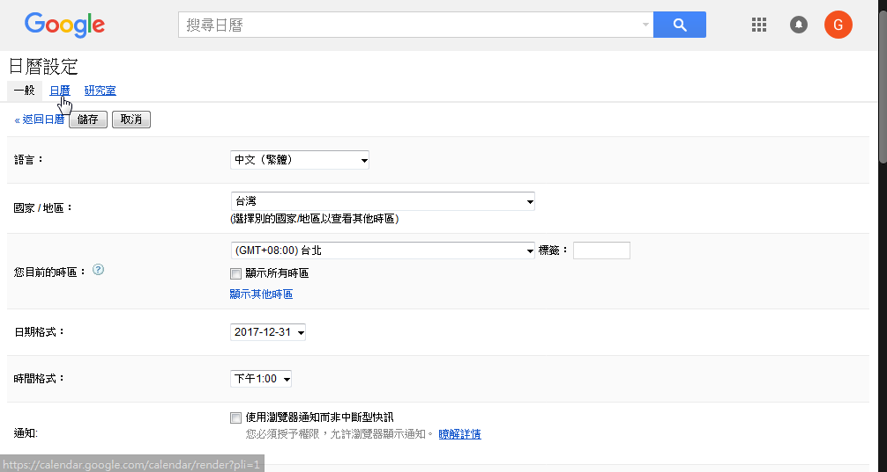

# Calendar parser  
This parser is used to parse your schdule / calendar from `.xlsx` file into `.csv` files.  
Then you can import those parsed `.csv` file into Google Calendar.  
  

* Background  
This project is originally used to improve the workflow of school in editing their calendar (semester schedule).  
If you are working on it through Microsoft Word / Excel, you might be bothered by the issue of co-working on a single file simultaneously.  

* requirement  
1. Python 2.7 (for Windows user, [WinPython][1] is recommended)  
2. .Net Framework 4.0 (for UI only, or you can just use this app by command line)

---  

## Editing calendar (semester schedule)  
You can take this [template][2] as a reference.  

* Format for editing events  
  

|Event type|Format|Example|
|---|---|---|
|No specified time|`* - event title`|* - Meeting_preparation|
|Single day|`date - event title`|29 - Doge's_birthday (no birthday cake?!)|
|Specific time in a single day|`date^time - event title`|15^8:00 - Story_time @classroom|
|Specific time range in a single day|'date^time01~time02 - event title`|9^9:00~16:00 - Sports_competition|
|Multiple day|`date01~date02 - event title`|10~11 - Final_exam|

Note that the date range of the week is written in [template][2], so that we just have to write the day of a date in the beginning of an event.  

* Notice
1. `location` and `description` can be ignored  

2. Numbers, spaces and punctutation marks should be half-width  
```
good: 18 - midterm @classroom
bad: １８ － midterm ＠classroom
```

3. The minus mark must be written  
```
good: 18 - midterm
bad: 18 midterm
```

4. No space following after `@` and `()`  
```
good: 18 - midterm @classroom
bad: 18 - midterm @ classroom

good: 18 - midterm (math)
bad: 18 - midterm ( math )
```

5. Order of `location` and `description` should not be reversed  
```
good: 18 - midterm @classroom (math)
bad: 18 - midterm (math) @classroom
```

6. Spaces are recommened to used between each fields  
```
good: 18 - midterm @classroom (math)
bad: 18-midterm@classroom(math)
```

---  

## Use Calendar parser  

### Execute through cmd  
1. Change directory to [calendar-parser][app_download_link]  
``` > cd calendar-parser```

2. Specify the file to be parsed and a directory for saving output files  
``` > python main.py -f [file_to_be_parsed] -o [dir_for_output]```  
  

### Execute through UI
  

1. Open `CalendarParserUI.exe`  

2. Click the gear icon at the left-top side. Set the path of `Python.exe` and script of calendar parser (main.py).  
`Python.exe`: for WinPython user, it locates in `WinPython-64bit-2.7.9.X\python-2.7.9.amd64\python.exe`  
script of calendar parser: unzip [this][app_download_link] and it locates in this folder  

3. Click the left-side region to select a xlsx file, or just drag and drop file into it  

	  

4. Click the right-side folder icon to select the output folder  

5. Click the arrow in the middle region, and program runs  
Note that Chinese characters in output files might be garbled. That's because they are encoded in 'utf-8'.  
You can still import them to Google calendar normally.  

	  

---

## Import parsed files into Google Calendar  
  

1. Loggin into [Google Calendar][gcalendar], click the gear icon at the left-top side -> click `setting`  
  

2. Switch page to `Calendar`  
  

3. Click `import calendar`
  

4. Select those parsed files (.csv) and import them

	      


[1]: https://sourceforge.net/projects/winpython/files/WinPython_2.7/2.7.10.3/ "WinPython 2.7"
[2]: https://docs.google.com/spreadsheets/d/1_7grLuMZjpgWAr6zV3F3J2ROTaXUwPYXxwWaAP1L-Ro/edit?usp=sharing "Semester schedule template"
[app_download_link]: https://github.com/NaleRaphael/CalendarParser/releases/download/1.0.0/calendar_parser.rar
[gcalendar]: https://calendar.google.com/
